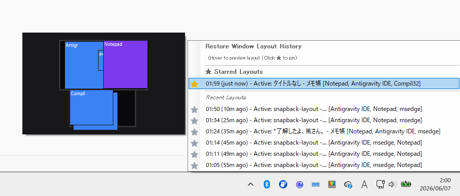

# snapback-layout

[English](#english) | [日本語](#日本語)

---

## English

`snapback-layout` is a lightweight, background utility for Windows that lets you capture and restore your window layouts instantly. It resides in the system tray, monitoring layouts, and restores them either with global hotkeys or from an intuitive left-click tray popup menu.

### Key Features

* 📸 **Instant Layout Backup & Restore**: Instantly save current desktop layouts and restore them precisely.
* ⌨️ **Global Hotkey Customization**: Custom hotkeys for saving and restoring layouts (supports modifier keys including the `Windows` key).
* ⏱️ **Silent Auto-Save**: Periodically backs up your layout in the background without disturbing your work.
* 📜 **Unified History Popup Menu**: Left-clicking the system tray icon displays a unified menu with instructions. Items display creation times, relative ages (e.g. `(5m ago)`), active window titles, and workspace tags (e.g. `[devenv, chrome]`).
* ⭐️ **Star / Lock Layouts**: Click the `☆` icon on any history item to toggle star status (`★`). Starred layouts are pinned to the top section, moved to a protected folder (`snapshots/favorites/`), and excluded from auto-pruning. The menu refreshes in-place instantly when starred.
* 🗺️ **Visual Map Hover Preview**: Hovering over any history item opens a small, non-obvious popup window next to the menu that visualizes the monitors and stacked windows. Topmost windows are correctly layered on top, minimized windows are excluded, and 6-letter process names are shown inside the boxes.
* 🖥️ **DPI Correction**: Automatically scales window bounds and relative coordinates when restoring layouts across monitors with different DPI factors.
* 🛟 **Off-screen Window Rescue**: Prevents "lost windows" by automatically centering coordinates onto the primary monitor if a saved window would restore off-screen (e.g., after disconnecting a monitor).
* 🥞 **Exact Z-Order Restoration**: Accurately restores the relative layering stack (front-to-back order) of all windows using sequential chaining.
* 📐 **Accurate Window Snapping (GetWindowRect)**: Correctly captures layout positions by utilizing `GetWindowRect` for normal windows to properly retrieve Windows 11 snap layout boundaries.
* 🚀 **Windows Startup Integration**: Option to automatically start the application on Windows logon, managed easily via the Registry.
* 🛡️ **Leak-Free Native Resource Management**: Explicitly disposes of GDI handles (`HICON`) and menu item objects to prevent resource leaks during long-running background execution.
* ⚡ **Ultra-lightweight**: Written in pure C# using Win32 APIs directly. No external dependencies, consuming less than 20MB of memory.

---

### Installation & Run

#### Prerequisites
* Windows 10 or Windows 11
* .NET 10.0 SDK

#### Running from Source
Run the following command in the project directory:
```powershell
dotnet run
```

#### Keyboard Shortcuts (Default)
* **Save Layout**: `Ctrl + Alt + S`
* **Restore Layout**: `Ctrl + Alt + R`

---

### Notes
- This application was developed using AI.
- Please be aware that code quality may require attention.
- While it should not contain any malicious code, please use it at your own risk.

---

## 日本語

`snapback-layout` は、Windows のウィンドウ配置（レイアウト）を瞬時に保存・復元できる軽量な常駐型ユーティリティです。システムトレイに常駐し、キーボードショートカットや一元化された左クリックメニュー操作によっていつでも元のレイアウトを復元します。

### 主な機能

* 📸 **レイアウトの即時保存・復元**: 現在のウィンドウ配置をキャプチャし、必要な時にいつでも元の位置・サイズに復帰させます。
* ⌨️ **カスタムホットキー**: 保存・復元のホットキーを自由に変更可能（`Windows` キーを含むショートカットキーに対応）。
* ⏱️ **静かな自動保存 (Auto-Save)**: 作業を邪魔しないサイレント仕様で、指定した間隔で自動的にバックアップを保存します。
* 📜 **一元化された履歴メニュー**: システムトレイアイコンを左クリックすると、説明付きの履歴ポップアップメニューが展開されます。各項目には相対的な経過時間（例：`(5m ago)`）やアクティブなアプリ名、起動中アプリのワークスペースタグ（例：`[devenv, chrome]`）が表示されます。
* ⭐️ **お気に入り（スター）機能**: 各項目の「☆」マークをクリックすると「★」に変わりお気に入りに登録されます。登録時はメニューを閉じず、その場で瞬時に再描画されます。お気に入りされたレイアウトは、自動クリーンアップ（Prune）から保護され、メニュー最上部の「★ Starred Layouts」欄に固定されます。
* 🗺️ **ビジュアルレイアウトプレビュー**: 履歴にホバーすると、モニターとウィンドウの配置関係を縮小表示したプレビュー（ミニマップ）が表示されます。最小化ウィンドウは除外され、ウィンドウの重なり順（前後関係）を正確に再現し、最大6文字のプロセス名が枠内に描画されます。
* 🖥️ **DPI自動補正機能**: 異なるDPIのモニター間でレイアウトを復元する際、解像度に合わせてサイズや相対位置を自動的にスケーリング補正します。
* 🛟 **画面外ウィンドウ救出機能**: モニター接続解除などにより復元先座標が画面外に孤立してしまう場合、メインモニターの安全な領域（中央）へ自動的に引き戻します。
* 🥞 **正確な Z-Order 復元**: すべてのウィンドウの重なり順（前後関係）を保存時の順番通りに忠実に再現します。
* 📐 **正確なスナップ位置のキャプチャ**: Windows 11 のスナップレイアウトの境界線を正確にキャプチャするため、通常状態のウィンドウは `GetWindowRect` から物理座標を取得します。
* 🚀 **Windows スタートアップ登録**: Windows 起動時に自動でバックグラウンド常駐を開始するオプションを提供します（レジストリによる制御）。
* 🛡️ **リソースリーク防止設計**: 長時間の常駐動作に伴うリソースリークを防ぐため、動的に生成したトレイアイコンの `HICON` やメニュー項目などのネイティブ GDI リソースを明示的に破棄します。
* ⚡ **超軽量動作**: Win32 API を直接利用する C# 実装。常駐時のメモリ消費量は 20MB 以下です。

---

### 使用方法

#### 動作環境
* Windows 10 または Windows 11
* .NET 10.0 SDK

#### ソースコードからの起動方法
プロジェクトディレクトリで以下のコマンドを実行します。
```powershell
dotnet run
```

#### デフォルトのショートカットキー
* **レイアウト保存**: `Ctrl + Alt + S`
* **レイアウト復元**: `Ctrl + Alt + R`

---

### 注意事項
- 本アプリはAIで作成されたアプリです。
- そのため、コードの品質には注意が必要です。
- 危険なコードは含まれていないはずですが、自己責任でご利用ください。

---

## License

This project is licensed under the MIT-0 License (MIT No Attribution). See the [LICENSE](file:///c:/Users/haman_9/dev/snapback-layout/LICENSE) file for details.
本プロジェクトは MIT-0 ライセンス (MIT No Attribution) の下で提供されています。詳細は [LICENSE](file:///c:/Users/haman_9/dev/snapback-layout/LICENSE) ファイルを参照してください。


## Screenshot



