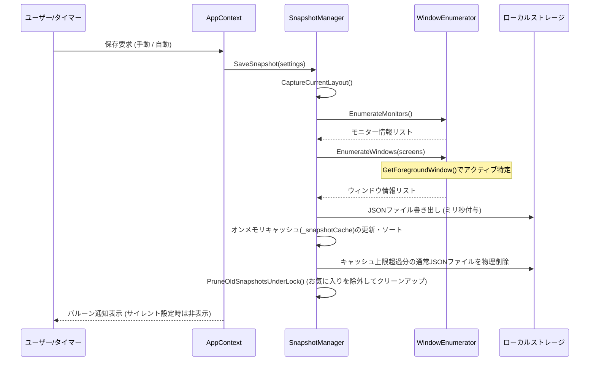
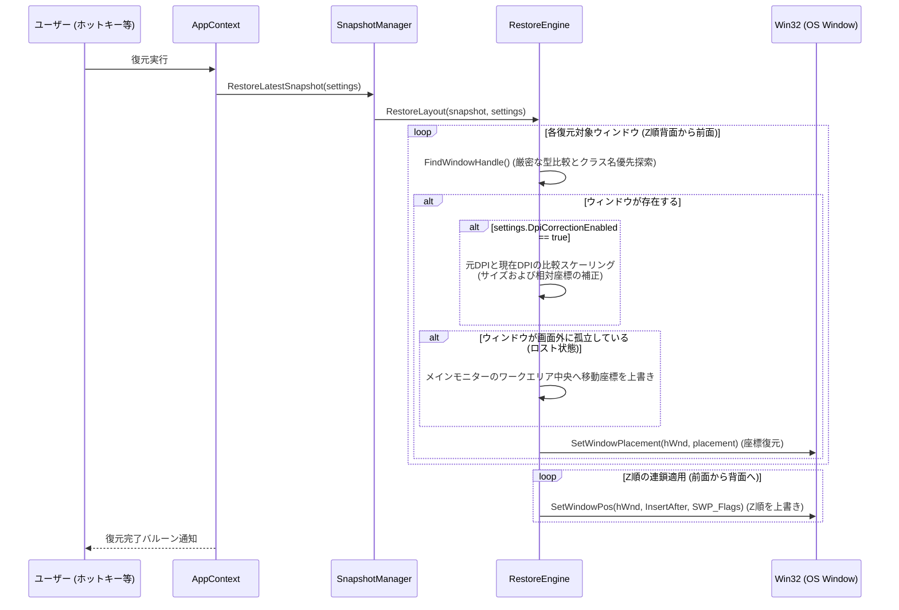

# snapback-layout システム設計書 (v1.2)

本ドキュメントは、Windows 10/11 向けの常駐型ウィンドウレイアウト保存・復元アプリケーションである `snapback-layout` のシステム設計書です。

---

## 1. システム概要 (System Overview)

`snapback-layout` は、マルチモニター環境や解像度変更、割り込み作業によって崩壊しやすいウィンドウ位置・サイズをワンクリックまたはホットキー操作で瞬時に保存し、元のレイアウトに復元するユーティリティです。
Windows API を直接利用した軽量な C# (.NET 10 / Windows Forms) アプリケーションとして実装されており、システムトレイ（タスクトレイ）に常駐して動作します。

---

## 2. 機能要件 (Requirements & Features)

### 2.1 コア機能
1. **レイアウト保存 (Save Layout)**:
   - 現在表示されているすべての有効なアプリケーションウィンドウの座標、サイズ、表示状態（通常・最大化・最小化）、重なり順（Z-Order）をキャプチャし、JSON 形式でディスクに保存します。
2. **レイアウト復元 (Restore Layout)**:
   - 保存されたスナップショットに基づき、ウィンドウ配置を正確に再構築します。
   - すでに終了したプロセスは復元時にスキップされ、現在起動しているウィンドウのみが復元されます。
3. **履歴管理と一元化されたクイックアクセスメニュー (Unified History Menu)**:
   - 最大12個のスナップショット履歴を管理します。
   - **システムトレイアイコンを左クリックすると、説明用ヘッダーと操作ガイドの付いた履歴ポップアップメニュー（`_historyContextMenu`）がマウス位置に直接表示されます。**
   - 右クリックメニューは管理用（Save, Restore, Settings, Exit）にシンプルに徹し、履歴に関する機能はすべて左クリックメニューへ一本化しています。
4. **お気に入り（スター）機能 (Starred / Pinning Layouts)**:
   - 履歴メニューの左端のスターアイコンをクリックして、特定のレイアウトをお気に入りとして登録・固定できます。
   - お気に入りに登録されたレイアウトは自動クリーンアップ（Prune）の対象から保護されます。
   - スターをオン/オフする際、メニューを閉じずにインプレースで最新状態に更新するUXを提供します。
5. **インタラクティブなグラフィカルプレビュー (Live Layout Preview)**:
   - 履歴アイテムにマウスをホバーすると、ウィンドウ配置を視覚的に表現したプレビュー（ミニマップ）が非アクティブなポップアップ（`ToolStripDropDown`）として描画されます。
   - 最小化されたウィンドウはプレビューから除外され、ウィンドウの重なり順（Z-Order）も忠実に再現されます。
6. **経過時間とアクティブ/起動アプリ情報の表示**:
   - 各スナップショット項目には、「10m ago」「2h ago」のような作成からの経過時間と、作成時に最前面だったアクティブウィンドウタイトル、および起動中だったプロセス名のリスト（最大3つ、例: `[devenv, chrome, slack]`）が表示されます。
7. **グローバルホットキー (Global Hotkeys)**:
   - バックグラウンド動作中、キーボードショートカット（例：`Ctrl + Alt + S` で保存、`Ctrl + Alt + R` で復元）を押すだけでウィンドウレイアウトの保存と復元が行えます。
   - Windowsキー（Win）を含めた組み合わせも設定可能です。
8. **自動保存 (Auto-Save)**:
   - 設定された時間間隔（1分〜30分）で定期的にバックグラウンド保存を実行します（作業の邪魔にならないようサイレントに動作します）。

### 2.2 堅牢性・保護機能
* **正確なスナップ位置のキャプチャ (GetWindowRect integration)**:
   - Windows 11 のスナップ機能によって配置されたウィンドウ座標を正しく取得するため、通常状態のウィンドウは `GetWindowPlacement` ではなく `GetWindowRect` を用いて物理座標を取得します。最小化・最大化状態のウィンドウは `GetWindowPlacement` の座標をフォールバックとして利用します。
* **DPIスケーリング補正 (DPI Correction)**:
   - 保存時と復元時でモニターの解像度やDPI（ディスプレイ拡大率）が変更されている場合、元のモニター基準からサイズおよび相対座標を動的に再計算してスケール調整します。
* **画面外孤立の防止機能 (Window Rescue)**:
   - サブモニターの切断などによって、復元先ウィンドウが現在どの物理モニターの描画領域（ワークエリア）にも属さない（画面外に孤立する）状態になった場合、自動的にメインモニターのワークエリア中央へ移動・再配置してユーザーの操作不能に陥るのを防ぎます。
* **厳密な重なり順の復元 (Z-Order Chaining)**:
   - 保存時のZ順インデックスに従ってウィンドウをソートし、最前面ウィンドウから順に `SetWindowPos` を用いて連鎖的（Chaining）に配置することで、アクティブ/非アクティブを含む前後関係を忠実に復元します。
* **GDIおよびハンドルリソースリークの防止**:
   - 動的に生成するトレイアイコンの `HICON` や、履歴メニューの DropDownItems など、OSのネイティブグラフィック資源を明示的に解放・破棄（`DestroyIcon`, `Dispose`）し、長時間の常駐に伴うリソースリークを防ぎます。
* **レジストリスタートアップ登録 (Windows Startup)**:
   - Windows 起動時に自動でバックグラウンド常駐を開始するオプションを提供します。

---

## 3. データ構造 (Data Schema)

スナップショットは以下の JSON スキーマに従い、実行環境の `snapshots/` またはお気に入り用の `snapshots/favorites/` ディレクトリに保存されます。C# 側は PascalCase、JSONシリアライズ時は camelCase で統一されています。

```json
{
  "timestamp": "2026-06-06T17:20:00",
  "monitors": [
    {
      "id": 1,
      "deviceName": "\\\\.\\DISPLAY1",
      "bounds": { "x": 0, "y": 0, "w": 1920, "h": 1080 },
      "dpi": 96
    }
  ],
  "windows": [
    {
      "hwnd": 197128,
      "processId": 8344,
      "processName": "devenv",
      "title": "snapback-layout - Microsoft Visual Studio",
      "className": "HwndWrapper[DefaultDomain;;...]",
      "state": "normal",
      "bounds": { "x": 100, "y": 50, "w": 1400, "h": 900 },
      "zIndex": 1,
      "monitorId": 1,
      "isForeground": true
    }
  ]
}
```

---

## 4. クラス・モジュール設計 (Module Design)

アプリケーションは以下の C# ソースコード群で構成されています。

### 4.1 エントリーポイント
* **Program.cs**:
  - アプリケーションを起動し、`AppContext.cs` に実行制御を引き渡します。

### 4.2 コア常駐制御
* **AppContext.cs**:
  - `ApplicationContext` を継承し、メインUIを表示せずにトレイアイコンと右クリックメニュー（`_contextMenu`）を管理します。
  - 左クリックされた際は、説明用ヘッダーと未保存時のヘルプガイド付きの `_historyContextMenu` をポップアップ表示します。
  - お気に入り登録・解除時、メニューを閉じずにインプレースでメニューの中身を最新化する `PopulateHistoryMenu()` メソッドを実装しています。
  - クリック時に他のウインドウが選択された際、メニューが自動的に閉じるように、メニューオープン前に `Win32.SetForegroundWindow()` を呼び出してフォーカス権限を確立します。
  - ホットキー登録制御クラス `HotkeyWindow`（隠しメッセージウィンドウ）をメンバーとして保持し、OSの `WM_HOTKEY` メッセージを受信します。
  - 常駐終了時に GDI リソースリークを防ぐため、`Dispose` 内でトレイアイコンの `HICON` を `DestroyIcon` で明示的に破棄します。

* **HotkeyWindow.cs**:
  - ホットキー処理のために `NativeWindow` を継承したバックグラウンドヘルパークラス。
  - タスクバーや Alt+Tab、画面描画に一切干渉しないよう、親ウィンドウのハンドル作成パラメータに `HWND_MESSAGE` (`(IntPtr)(-3)`) を指定し、完全に隠蔽されたメッセージ専用ウィンドウとして初期化します。

### 4.3 ウィンドウ・モニター検出
* **WindowEnumerator.cs**:
  - `EnumWindows` を呼び出して現在のアクティブなデスクトップウィンドウを巡回します。
  - `Normal` 状態のウィンドウについては `GetWindowPlacement` でなく `GetWindowRect` を用いて、スナップレイアウトの状態を含む物理的な現在座標を正確に取得します。
  - PIDとプロセス名のマッピングをループ内でキャッシュし、`Process.GetProcessById` コールの重複を防ぎ高速化します。
  - Windows API `Win32.MonitorFromPoint` 等からウィンドウに対応するモニターの `DeviceName` を特定します。

### 4.4 レイアウト復元ロジック
* **RestoreEngine.cs**:
  - スナップショットからウィンドウを復元する最重要モジュール。
  - 復元時、PIDの暗黙キャストによる一致判定ミスを回避するため `IsWindowStillValid` で `(uint)processId` として厳密に型を揃えて検証します。
  - 起動HWNDが失われている場合のウィンドウ検索フォールバックロジックにおいて、`ClassName` と `Title` が一致する最適なウィンドウを優先マッチングし、誤マッチングを低減します。
  - **DPI補正**: 元DPIと現在のDPIを比較し、サイズと相対座標を動的に再計算します。
  - **ロスト防止**: ウィンドウが画面外に孤立する場合にメインモニターのワークエリア中央へ引き戻します。
  - **Z順の連鎖**: Zインデックス順にソートし、最上位を `HWND_TOP` に設定後、後続ウィンドウを先行ウィンドウの背後へ順番に `SetWindowPos` を用いて連鎖的に配置します。

### 4.5 ストレージと構成設定
* **SnapshotManager.cs**:
  - キャプチャした `Snapshot` オブジェクトの JSON シリアライズ・デシリアライズ、およびファイル保存を処理します。
  - 履歴ファイル名にミリ秒までのタイムスタンプ（`snapshot_yyyyMMdd_HHmmss_fff.json`）を導入し、同時生成での衝突を防ぎます。
  - キャッシュが上限数を超えてトリミングされる際、**対応するディスク上の古いJSONファイルも同期して即時削除します。** お気に入り登録されたスナップショットは Prune の対象外となります。
  - 履歴メニューの展開遅延を無くすため、スレッドセーフなオンメモリキャッシュ `_snapshotCache`（最大12件）を実装・保持します。
* **Settings.cs**:
  - 自動保存の有無、間隔、履歴保持時間、DPI補正の有無、スタートアップ、各種ホットキー定義データを保持し、JSON 形式でローカル構成に保存します。
  - シリアライズオプション（`JsonSerializerOptions`）を静的読み取り専用フィールドとして保持し、メモリ再確保の負荷を軽減しています。
  - 構成ファイル（JSON）のデシリアライズ失敗（破損等）の例外を検知した際、自動的に破損ファイルを `.bak` に退避（リネーム）してデフォルト値で安全に初期化するセーフガード設計を採用しています。

### 4.6 UIおよび入力コントロール
* **SettingsForm.cs**:
  - 設定変更用ダイアログ画面。
  - 3つの `GroupBox`（Layout Backup & Restore, Keyboard Shortcuts, System Integration）により項目を整然とグループ化しています。
  - OKボタンにパープルカラー（`#7C3AED`）、Cancelおよび「Reset Defaults」ボタンにフラットグレーをあしらい、現代的なフラットデザインを構成しています。
* **HotkeyTextBox.cs**:
  - 任意のホットキーを記録するための専用テキストボックス。
  - フォーカス時に背景を薄い紫（`RGB(245, 243, 255)`）へ変更して「Press keys...」とキー待ち受け状態を示し、ショートカット入力成功（またはエスケープ解除）時に自動でフォーカスを親フォームへ逃がす（`this.FindForm()?.Focus()`）UXを実装しています。
  - `Win32.GetKeyState` で `VK_LWIN`/`VK_RWIN` の物理キーの押下を判定し、Winキー対応を実現します。
* **PreviewControl.cs**:
  - スナップショットのウィンドウ配置をプレビュー（ミニマップ）としてグラフィカルに描画するカスタムコントロール。
  - モニターの座標を縮尺を合わせて描画し、その中に各ウィンドウを Z-order 降順（背面から描画し、最前面が一番上に重なる）でベタ塗り矩形（アクティブは紫、通常は青）として描画します。
  - 最小化されているウィンドウは描画対象から除外し、ウィンドウ内の十分なスペースがある場合に最大6文字のアプリ名（プロセス名）をラベルとして描画します。
* **HotkeyHelper.cs**:
  - 修飾キーとキーコードから `Ctrl + Alt + Win + S` のような人間が読める文字列を一貫してフォーマットする共通スタティッククラス。

### 4.7 Win32 ネイティブブリッジ
* **Win32.cs**:
  - Win32 API の DLLインポート（`user32.dll`, `shcore.dll`）、定数（`GWL_STYLE`, `MOD_WIN` など）、構造体（`RECT`, `WINDOWPLACEMENT`）を定義したブリッジモジュールです。
  - `MonitorFromPoint` などのP/Invoke宣言もこのクラスに一元化されています。

---

## 5. 主要処理フロー (Key Sequences)

### 5.1 保存処理シーケンス


### 5.2 復元処理シーケンス (DPI補正・ロスト保護・Z順復元)


---

## 6. 非機能設計と最適化 (Performance & UX Optimization)

1. **ToolStripDropDown を用いた非アクティブ・ポップアップ**:
   - `PreviewControl` の表示には `ToolStripDropDown` メニューコンテナーを採用しています。これにより、プレビューポップアップ表示中にフォーカス遷移（アクティブ状態の変更）が発生せず、履歴選択メニューが勝手に閉じてしまうという不具合を100%防止しています。
2. **オンメモリ履歴キャッシュによるI/O遮断**:
   - システムトレイメニューを開く際、ファイルI/Oを一切発生させず、起動時に一括取得され、保存時に更新されるオンメモリキャッシュ（`_snapshotCache`）から履歴リストを瞬時にレンダリングします。これによりUIのプチフリーズが解消されています。
3. **PID-ProcessName キャッシュ**:
   - `WindowEnumerator` および `RestoreEngine` 内のウィンドウ探索ループで、同一のプロセスの名前を繰り返し引かないようキャッシュするため、多数のウィンドウが存在する場合も極めて低負荷で巡回を完了させます。
4. **キーボードフォーカス制御**:
   - `HotkeyTextBox` は、単に文字を書き換えるだけのテキストボックスではなく、入力完了と同時に `FindForm()?.Focus()` により即座に親フォームにフォーカスを戻し、直感的かつ安全にキーボードフック入力状態から脱出できる仕組みを備えています。
5. **低メモリフットプリント**:
   - 外部ライブラリに一切依存せず、.NET 10 標準クラスライブラリと Windows API のみを仲介するため、常駐時の物理メモリ消費量は 20MB 前後に抑えられています。
