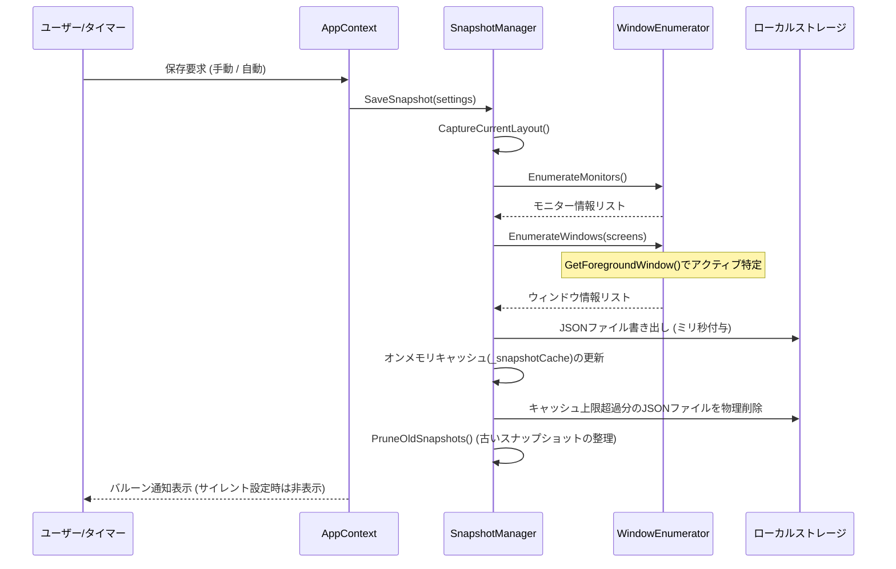

# snapback-layout システム設計書 (v1.1)

本ドキュメントは、Windows 10/11 向けの常駐型ウィンドウレイアウト保存・復元アプリケーションである `snapback-layout` のシステム設計書です。

---

## 1. システム概要 (System Overview)

`snapback-layout` は、マルチモニター環境や解像度変更、割り込み作業によって崩壊しやすいウィンドウ位置・サイズをワンクリックまたはホットキー操作で瞬時に保存し、元のレイアウトに復元するユーティリティです。
Windows API を直接利用した軽量な C# (.NET 10 / Windows Forms) アプリケーションとして実装されており、システムトレイ（タスクトレイ）に常駐して動作します。

---

## 2. 機能要件 (Requirements & Features)

### 2.1 コア機能
1. **レイアウト保存 (Save Layout)**:
   - 現在表示されているすべての有効なアプリケーションウィンドウの座標、サイズ、表示状態（通常・最大化・最小化）、重なり順（Z-Order）をキャプチャし、JSON 形式でディスクに保存します。
2. **レイアウト復元 (Restore Layout)**:
   - 保存されたスナップショットに基づき、ウィンドウ配置を正確に再構築します。
   - すでに終了したプロセスはスキップされ、現在起動しているウィンドウのみが復元されます。
3. **履歴管理 (Layout History)**:
   - 最大12個のスナップショット履歴を管理します。
   - **システムトレイアイコンを左クリックすると、履歴スナップショットの一覧ポップアップメニューがマウス位置に直接表示されます。**
   - 項目（例：`17:45 - Active: [devenv] design_document.md (+5 windows)`）をクリックするだけで、1アクションでレイアウトを瞬時に復元できます。
   - 右クリックから展開されるメインメニュー内にも「History」項目があり、同じ履歴一覧にアクセス可能です。
4. **グローバルホットキー (Global Hotkey)**:
   - 常駐状態のまま、キーボードショートカット（初期値: `Ctrl + Alt + S` で保存、`Ctrl + Alt + R` で復元）を通じて高速に保存・復元を行えます。
   - ショートカットキーには `Windows` ロゴキーを含めることが可能です。
5. **自動バックアップ (Auto-Save)**:
   - 指定した間隔（1分〜30分）で定期的にバックアップを自動生成します（自動保存はユーザーを邪魔しないようサイレントに動作します）。

### 2.2 特殊処理・保護機能
* **DPI自動スケーリング補正 (DPI Correction)**:
   - 保存時と復元時でモニターの解像度やDPI（ディスプレイ拡大率）が変化している場合、ウィンドウサイズおよびモニター内の相対位置を自動計算して拡大縮小復元します。
* **画面外ウィンドウ救出機能 (Window Rescue)**:
   - サブモニターが切断されるなどして、復元座標が現在の物理画面内に存在しない（画面外に孤立する）場合、メインモニターのワークエリア中央へ安全に再配置して復帰させます。
* **正確な Z-Order 復元 (Z-Order Chaining)**:
   - 重なり順のインデックスに従ってウィンドウを `SetWindowPos` を用いて連鎖的（Chaining）に配置し、最前面から最背面までの関係を忠実に復元します。
* **GDI オブジェクトリーク防止 (GDI Protection)**:
   - 動的に生成するトレイアイコンの `HICON` や履歴メニューの DropDownItems を明示的に解放・破棄（`DestroyIcon`, `Dispose`）し、長時間の常駐に伴うリソースリークを防ぎます。
* **レジストリスタートアップ登録 (Windows Startup)**:
   - Windows 起動時に自動でバックグラウンド常駐を開始するオプションを提供します。

---

## 3. データ構造 (Data Schema)

スナップショットは以下の JSON スキーマに従い、実行環境の `snapshots/` ディレクトリに保存されます。C#モデル側は PascalCase、JSONシリアライズ時は camelCase で統一されています。また、下位互換性のため幅と高さは `"w"` と `"h"` としてシリアライズされます。

```json
{
  "timestamp": "2026-06-06T17:20:00",
  "monitors": [
    {
      "id": 1,
      "deviceName": "\\\\.\\DISPLAY1",
      "bounds": { "x": 0, "y": 0, "w": 1920, "h": 1080 },
      "dpi": 96
    }
  ],
  "windows": [
    {
      "hwnd": 197128,
      "processId": 8344,
      "processName": "devenv",
      "title": "snapback-layout - Microsoft Visual Studio",
      "className": "HwndWrapper[DefaultDomain;;...]",
      "state": "normal",
      "bounds": { "x": 100, "y": 50, "w": 1400, "h": 900 },
      "zIndex": 1,
      "monitorId": 1,
      "isForeground": true
    }
  ]
}
```

---

## 4. クラス・モジュール設計 (Module Design)

アプリケーションは以下の C# ソースコード群で構成されています。

### 4.1 エントリーポイント
* **Program.cs**:
  - アプリケーションを起動し、`AppContext.cs` に実行制御を引き渡します。

### 4.2 コア常駐制御
* **AppContext.cs**:
  - `ApplicationContext` を継承し、メインUIを表示せずにトレイアイコンと右クリックメニュー（`_contextMenu`）を管理します。
  - **左クリック時のポップアップメニュー表示用の `_historyContextMenu` インスタンスをメンバーとして保持し、クリック時に中身を再構築して再利用することで、破棄に伴う例外（ObjectDisposedException）を防ぎつつメモリリークを抑えます。**
  - ホットキー登録制御クラス `HotkeyWindow`（隠しウィンドウ）を内包し、OSの `WM_HOTKEY` メッセージを受信します。
  - 設定フォームの呼び出し、タイマー制御、履歴メニュー（オンメモリキャッシュからの動的読み込み）を構築します。
  - 履歴メニュー項目の生成ロジックは `CreateSnapshotMenuItem()` に共通化・整理されています。

### 4.3 ウィンドウ・モニター検出
* **WindowEnumerator.cs**:
  - `EnumWindows` を呼び出して現在のアクティブなデスクトップウィンドウを巡回します。
  - 保存対象ウィンドウを列挙する際、`Win32.GetForegroundWindow()` を用いてキャプチャ時にユーザーが操作していた最前面ウィンドウ（IsForeground = true）を特定します。
  - 親ウィンドウではない、可視状態、アプリウィンドウ以外のツールウィンドウではない、タイトルが空ではない、シェル関連（タスクバーやプログラムマネージャー）ではない等のフィルタリングを適用し、保存候補を抽出します。
  - PIDとプロセス名のマッピングをループ内でキャッシュし、`Process.GetProcessById` コールの重複を防ぎ高速化します。
  - Windows API `Win32.MonitorFromPoint` 等からウィンドウに対応するモニターの `DeviceName` を特定します。

### 4.4 レイアウト復元ロジック
* **RestoreEngine.cs**:
  - スナップショットからウィンドウを復元する最重要モジュール。
  - **I/O削減**: 設定ファイル（Settings）はリストア処理の開始時に一度だけロードされ、各関数へ引数として渡される設計に最適化されました。
  - **DPI補正**: `settings.DpiCorrectionEnabled` に従い、元モニターDPIと現モニターDPIの比率からウィンドウサイズおよびモニター内の相対位置を動的に再計算します。
  - **ロスト防止**: ウィンドウが画面外に孤立する場合にプライマリモニターの画面中央へ引き戻します。
  - **Z順の連鎖**: Zインデックス順にソートし、最上位を `HWND_TOP` に設定後、後続ウィンドウを先行ウィンドウの背後へ順番に `SetWindowPos` を用いて連鎖的に配置します。
  - ウィンドウハンドル（HWND）が変更されている場合、PID（可視状態チェック付き）、クラス名、タイトル名等を段階的にマッチングするフォールバック検索処理を内包します。

### 4.5 ストレージと構成設定
* **SnapshotManager.cs**:
  - キャプチャした `Snapshot` オブジェクトの JSON シリアライズ・デシリアライズ、およびファイル保存を処理します。
  - 履歴ファイル名にミリ秒までのタイムスタンプ（`snapshot_yyyyMMdd_HHmmss_fff.json`）を導入し、同時生成での衝突を防ぎます。
  - キャッシュが上限数を超えてトリミングされる際、**対応するディスク上の古いJSONファイルも同期して即時削除します。**
  - 履歴メニューの展開遅延を無くすため、スレッドセーフなオンメモリキャッシュ `_snapshotCache`（最大12件）を実装・保持します。
* **Settings.cs**:
  - 自動保存の有無、間隔、履歴保持時間、DPI補正の有無、スタートアップ、各種ホットキー定義データを保持し、JSON 形式でローカル構成に保存します。

### 4.6 UIおよび入力コントロール
* **SettingsForm.cs**:
  - 設定変更用ダイアログ画面。
  - 3つの `GroupBox`（Layout Backup & Restore, Keyboard Shortcuts, System Integration）により項目を整然とグループ化しています。
  - OKボタンにパープルカラー（`#7C3AED`）、Cancelおよび「Reset Defaults」ボタンにフラットグレーをあしらい、現代的なフラットデザインを構成しています。
* **HotkeyTextBox.cs**:
  - 任意のホットキーを記録するための専用テキストボックス。
  - フォーカス時に背景を薄い紫（`RGB(245, 243, 255)`）へ変更して「Press keys...」とキー待ち受け状態を示し、ショートカット入力成功（またはエスケープ解除）時に自動でフォーカスを親フォームへ逃がす（`this.FindForm()?.Focus()`）UXを実装しています。
  - `Win32.GetKeyState` で `VK_LWIN`/`VK_RWIN` の物理キーの押下を判定し、Winキー対応を実現します。
* **HotkeyHelper.cs**:
  - 修飾キーとキーコードから `Ctrl + Alt + Win + S` のような人間が読める文字列を一貫してフォーマットする共通スタティッククラス。

### 4.7 Win32 ネイティブブリッジ
* **Win32.cs**:
  - Win32 API の DLLインポート（`user32.dll`, `shcore.dll`）、定数（`GWL_STYLE`, `MOD_WIN` など）、構造体（`RECT`, `WINDOWPLACEMENT`）を定義したブリッジモジュールです。
  - `MonitorFromPoint` などのP/Invoke宣言もこのクラスに一元化されています。

---

## 5. 主要処理フロー (Key Sequences)

### 5.1 保存処理シーケンス


### 5.2 復元処理シーケンス (DPI補正・ロスト保護・Z順復元)


---

## 6. 非機能設計と最適化 (Performance & UX Optimization)

1. **オンメモリ履歴キャッシュによるI/O遮断**:
   - システムトレイメニューを開く際、ファイルI/Oを一切発生させず、起動時に一括取得され、保存時に差分追加されるメモリ上のキャッシュから最大12件の履歴リストを瞬時にレンダリングします。これによりUIのプチフリーズが解消されています。
2. **PID-ProcessName キャッシュ**:
   - `WindowEnumerator` および `RestoreEngine` 内のウィンドウ探索ループで、同一のプロセスの名前を繰り返し引かないようキャッシュするため、多数のウィンドウが存在する場合も極めて低負荷で巡回を完了させます。
3. **キーボードフォーカス制御**:
   - `HotkeyTextBox` は、ただ文字を書き換えるだけのテキストボックスではなく、入力完了と同時に `FindForm()?.Focus()` により即座に親フォームにフォーカスを戻し、直感的かつ安全にキーボードフック入力状態から脱出できる仕組みを備えています。
4. **低メモリフットプリント**:
   - 外部ライブラリに一切依存せず、.NET 10 標準クラスライブラリと Windows API のみを仲介するため、常駐時の物理メモリ消費量は 20MB 前後に抑えられています。
